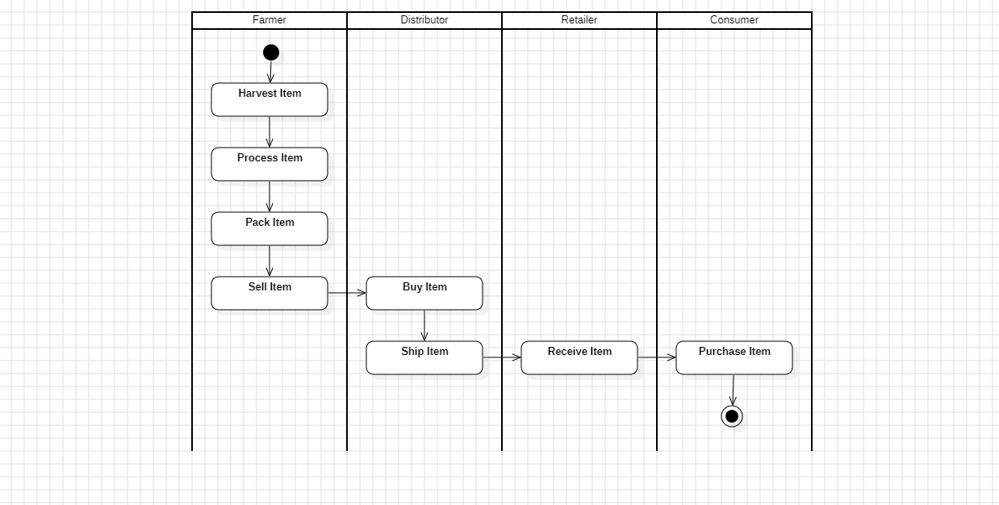

# Project with write-ups

---

## Project write-up - UML

```
The UML.mdj file is opened with the StarUML application
Homepage link: https://staruml.io/
```

#### 1. Activity Diagram




#### 2. Sequence Diagram


#### 3. State Diagram


#### 4. Class Diagram


## Project write-up - Libraries

- Truffle v5.11.5 (core: 5.11.5)
- Ganache v7.9.1
- Solidity v0.5.16 (solc-js)
- Node v20.13.1
- Web3.js v1.10.0
- truffle-hdwallet-provider v1.0.17


## Project write-up - IPFS

- Not used

## Contract Address

- Deploying 'Migrations'
  - Contract address: 0x5E046183d781F77a1749C89DcBeCE5D73DF79dDe
  - [Link Contract](https://sepolia.etherscan.io/address/0x5E046183d781F77a1749C89DcBeCE5D73DF79dDe)

- Deploying 'FarmerRole'
  - Contract address: 0x92AEb66adBe79EEf9f3657FC403BD1eaD8BB4047
  - [Link Contract](https://sepolia.etherscan.io/address/0x92AEb66adBe79EEf9f3657FC403BD1eaD8BB4047)

- Deploying 'DistributorRole'
  - Contract address: 0x90FE35a1598a67d9E236AAE3270c1bdbd621Ea7A
  - [Link Contract](https://sepolia.etherscan.io/address/0x90FE35a1598a67d9E236AAE3270c1bdbd621Ea7A)

- Deploying 'RetailerRole'
  - Contract address: 0x1de48136EF57a264BBfb76a2A64e5BF88B8d385f
  - [Link Contract](https://sepolia.etherscan.io/address/0x1de48136EF57a264BBfb76a2A64e5BF88B8d385f)

- Deploying 'ConsumerRole'
  - Contract address: 0xAAfb6E646aff619c1d9C89aA1d1520f96b02EB5D
  - [Link Contract](https://sepolia.etherscan.io/address/0xAAfb6E646aff619c1d9C89aA1d1520f96b02EB5D)

- Deploying 'SupplyChain'
  - Contract address: 0xB2E9265A8546122260D7216f27275e39b9E0cD34
  - [Link Contract](https://sepolia.etherscan.io/address/0xb2e9265a8546122260d7216f27275e39b9e0cd34)
